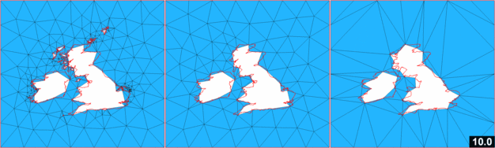
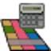

 QGIS meshing plugins
=========================================================

QGIS plugins for meshing geophysical domains.

Outline web page: [QGIS-Meshing](http://adamcandy.github.io/QGIS-Meshing)

Test engine status
------------------

 Release

 Development

<!-- Development reporting on compound lines and boundary IDs on hold
 Development (Compound Lines and Boundary IDs)
-->

Outline
-------

This project contains four plugins for the generation of surface meshes in QGIS:

####  Mesh surface plugin,
####  Boundary identification plugin,
####  Rasterise Polygons plugin, and 
####  Raster Calculator plugin.

Installation
------------

### Ubuntu package

For anyone who would like to experiment with the plugins, please download the qgis-plugins-meshing Ubuntu package which is available in the following PPA:

    ppa:meshing/release

(which depends on packages in ppa:ubuntugis/ppa)

Commands required:

    sudo add-apt-repository ppa:ubuntugis/ppa
    sudo add-apt-repository ppa:meshing/release
    sudo apt-get update
    sudo apt-get install qgis-plugins-meshing

If the final command fails, please download the package manually from

    http://amcg.ese.ic.ac.uk/~asc/public/qgis-plugins-meshing_1.9_all.deb

and install with

    sudo dpkg -i qgis-plugins-meshing_1.9_all.deb

(there is a fix for Precise, which is currently being processed by Launchpad)

### Development manual install

Clone the GitHub repository and use the following:

    make install

This will install the plugins for all users (and requires superpowers).
For a single-user install, use the following:

    make installlocal

Manual
------

Further information on the dependencies can be found in the manual at:
[http://amcg.ese.ic.ac.uk/~asc/public/meshing_manual.pdf](http://amcg.ese.ic.ac.uk/~asc/public/meshing_manual.pdf)

Testing
-------

Test the plugins with the following command executed in the root folder of the repository

    make test

A buildbot has been setup to continuously tests new commits, see [QGIS-Meshing buildbot](https://travis-ci.org/adamcandy/QGIS-Meshing).

Development
-----------

### Contributing

Contributions to the plugins are very welcome.  Get involved!

Development follows the model described at [nvie.com/git-model](http://nvie.com/git-model), with the main development branch named 'dev' and tested development branches prefixed with 'dev-'.

* Please fork the main repository (e.g. with this [link](https://github.com/adamcandy/QGIS-Meshing/fork)).

* Branch from the master (ideally prefixed 'dev') and make the code changes, ensuring all tests pass.

* Create a pull request back.

The changes will be tested by a buildbot in a sterile environment to check tests pass and code integrity in maintained.
With a green light, the changes will be merged in.
Thanks!

### Current development

Milestones for the project can be viewed at [Milestones](https://github.com/adamcandy/QGIS-Meshing/issues/milestones).

Current development focus is on a test engine to ensure the plugins are robust.

### Issue tracker

Issues and bugs found with the project can be viewed and edited at [Issues](https://github.com/adamcandy/QGIS-Meshing/issues?state=open).

### Resources for developers

The plugins are written in Python, each being a [Python package](http://docs.python.org/2/tutorial/modules.html#packages).
A guide to developing Python plugins for QGIS is available [here](http://www.qgis.org/pyqgis-cookbook/plugins.html#plugins).
The [PyQGIS Developer Cookbook](http://www.qgis.org/pyqgis-cookbook/) is also a useful resource.

Further information
-------------------

Additional information on this work, with further details on simulation initialisation in general are available from the research group pages at:

• [http://amcg.ese.ic.ac.uk/meshing](http://amcg.ese.ic.ac.uk/meshing)

• [http://www3.imperial.ac.uk/earthscienceandengineering/research/amcg/meshing](http://www3.imperial.ac.uk/earthscienceandengineering/research/amcg/meshing)

Contact
-------

The plugin developers can be contacted via the maintainer [Adam Candy](http://www3.imperial.ac.uk/people/adam.candy), GitHub user <a href="https://github.com/adamcandy">adamcandy</a>.

License
-------

The QGIS-Meshing plugins free software; you can redistribute it and/or modify it under the terms of the GNU Lesser General Public License as published by the Free Software Foundation, version 2.1 of the License.

Copyright (C) 2012-2013 Imperial College London and others.
See the AUTHORS file in the main source directory for a full list of copyright holders.

